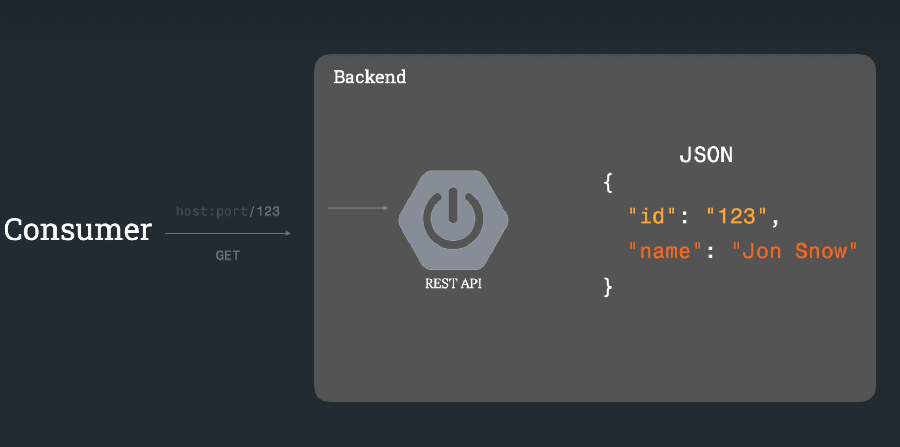
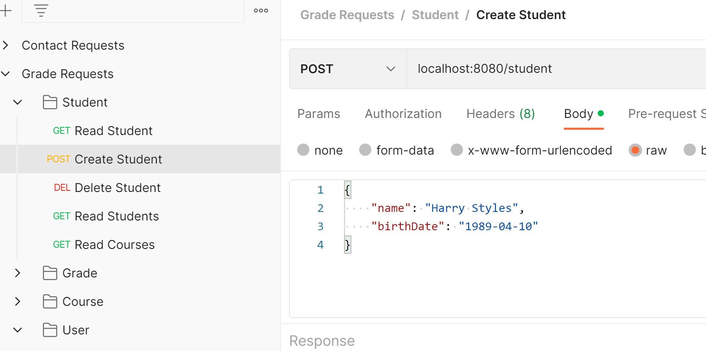
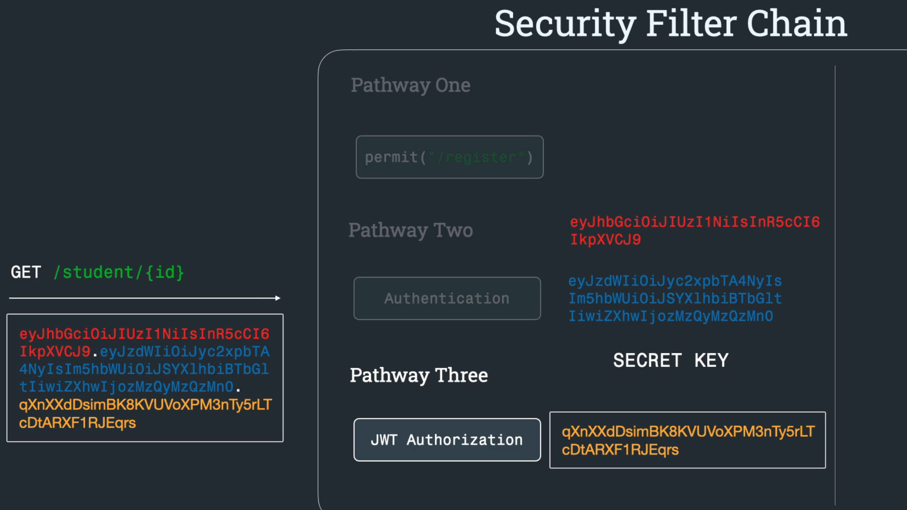

# School Admin Rest API

---

### REST Guidlines
  - Resource: The data includes students, courses, grades, and users
  - URI: the location of the resources are identified with logical endpoints, such as "/student/123" to read student with id 123.
  - The Rest API defines the following operations that can manipulate the resources: GET, POST, PUT, DELETE
  - Resources are represented using JSON

  - Collection: the grouping of resources can be accessed with GET requests, for example with the endpoint "/grade/all"

---

### Dependencies
  - Spring Boot Starter Data JPA
  - Spring Boot Starter Web
  - Spring Boot Devtools
  - Mysql Connector J
  - Lombok
  - Spring Boot Starter Test
  - Spring Boot Starter Validation
  - Spring Boot Starter Security
  - Java JWT

---

### POST operation example
- The consumer is expected to send a POST request. In this example, to create a student, name and birthdate will be the payload sent on the endpoint "/student".  

  
- In the Controller class @PostMapping annotation is used to map requests to a handler method. @RequestBody deserializes the contents of the json payload into a Java object and an HTTP Status is returned.

```
@AllArgsConstructor
@RestController
@RequestMapping("/student")
public class StudentController {

    private StudentService studentService;

    @PostMapping
    public ResponseEntity<Student> saveStudent(@RequestBody Student student) {
        return new ResponseEntity<>(studentService.saveStudent(student), HttpStatus.CREATED);
    }
```
- To save the student in the Repository, The Service layer, the middleman between the Repository and the Controller, utilizes interfaces to establish contracts for the Service implementation classes

```
public interface StudentService {
    Student getStudent(Long id);
    Student saveStudent(Student student);
    void deleteStudent(Long id);
    List<Student> getStudents();
}
```
- The Service implementation class overrides the implementation stipulated by the service interface and provides the business logic.  Here the student repository is autowired and accessed:

```
@AllArgsConstructor
@Service
public class StudentServiceImpl implements StudentService {

    private StudentRepository studentRepository;

    @Override
    public Student saveStudent(Student student) {
        return studentRepository.save(student);
    }
```
### Data Store
- The datastore, a Mysql DB in a Docker container, is defined with docker-compose.yml:
```
version: '3.3'
services:
  db:
    image: mysql/mysql-server:8.0
    restart: always
    environment:
      MYSQL_DATABASE: 'school'
      MYSQL_USER: 'root'
      MYSQL_PASSWORD: 'root'
      MYSQL_ROOT_PASSWORD: 'root'
    ports:
      - '3366:3306'
    expose:
      - '3306'
    volumes:
      - my-db:/var/lib/mysql
volumes:
  my-db:
```
### Security 
- The Security Filter Chain is set up with 3 paths
  - Pathway 1: Anyone submitting request on endpoint "/register" will have access without authentication or authorization
  - Pathway 2: Anyone submitting request on endpoint "/authenticate" will be processed with an authentication filter using an algorithm to encrypt the password to check if it matches the user's kept password.  If successful, a response of 200 and a JWT token will be returned.
  - Pathway 3: The security filter will produce a test signature that combines the header, body and secret and compare it against any tokens provided with requests to test validity of token. 
- Token-based Authentication - JWT (JSON Web Token)
  - Header: (Algorithm, JWT)
  - Payload: (Subject, Name, Expiry)
  - Signature: (Header, Payload, Secret)




